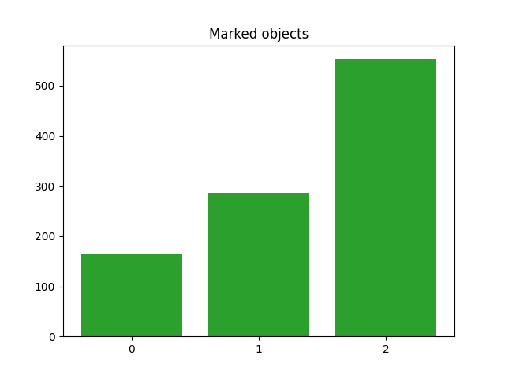

# Visualise number of objects in YOLO training dataset

## How to use?

1. Put your annotations in "annotations" directory.
    
   Example of annotation file:\
   2 0.187500 0.341406 0.370192 0.573438\
   2 0.584135 0.331250 0.389423 0.518750\
   2 0.923077 0.421094 0.153846 0.554688
   
   (In this case 2 is the class number)

2. Run merge_annotations.py
3. Run main.py to get chart.

